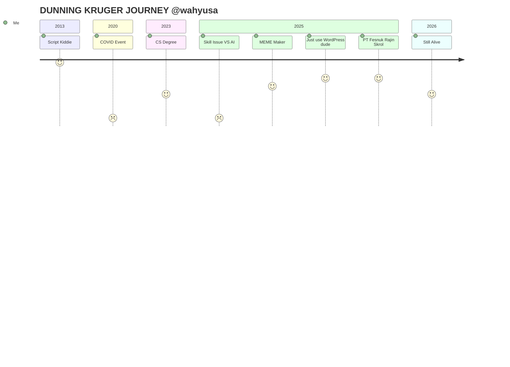

### Hi there 👋

---

## Wahyu SA

**Software Engineer / Web Developer**

I have a Computer Science degree and operate a small legal business entity. I’m currently looking for full-time engineering roles or internships focused on building and maintaining real software.

### What I Actually Do
- I build CLI tools, CRUD apps, REST API and static websites.
- Prefer simple architectures early, and introduce complexity only when the problem requires it.
- I write personal technical notes and documentation

### Tech Stack I Actually Use
* **Backend:** Go, PHP.
* **Frontend:** Svelte, Astro, Tailwind CSS, Typescript.
* **Ops/Other:** Linux, Cloudflare

### Current Projects
- **SME Static Website Service:** Building affordable, high-performance static sites using Astro. (part of my business)
- **Technical Journal:** [wsa.my.id](https://wsa.my.id)
<!--
- **Boring App Usage Tracker:** Android app usage analytics (Kotlin) (ai-slop-not-yet-optimized-but-working-mvp-or-wip-at-least-for-me).
- **Timecalc:** Average name I should change for time converter/calculator cli built with Rust (ai-slop-not-yet-optimized-but-working-mvp-or-wip-at-least-for-me).
- **Bleeding edge tech news:** https://200.web.id (Just yet another idea)
- **Boring Storytelling Svelte**: https://junior.web.id (Yet another idea)
-->

### Joke / Lore
> **"TOP 1 NGANGGUR"** (TOP 1 UNEMPLOYED) - *Facebook IMPHNEN*
>
> *(I do have a job, it's just not in tech... yet.)*
---

<section>
    <!-- From my private repo
    https://github.com/wahyusa/github-stat
    https://github.com/wahyusa/github-stat-summary
    https://github.com/wahyusa/github-readme-streak-stats -->
    

    <!-- card_height=165 is the smallest value set in my repo https://github.com/wahyusa/github-readme-streak-stats/blob/5b873f0587e19afc97d808b846f53f3ba9e6c673/api/card.php#L335 -->

<!--  -->
</section>
<!--
**wahyusa/wahyusa** is a ✨ _special_ ✨ repository because its `README.md` (this file) appears on your GitHub profile.

Here are some ideas to get you started:

- 🔭 I’m currently working on ...
- 🌱 I’m currently learning ...
- 👯 I’m looking to collaborate on ...
- 🤔 I’m looking for help with ...
- 💬 Ask me about ...
- 📫 How to reach me: ...
- 😄 Pronouns: ...
- ⚡ Fun fact: ...
-->
