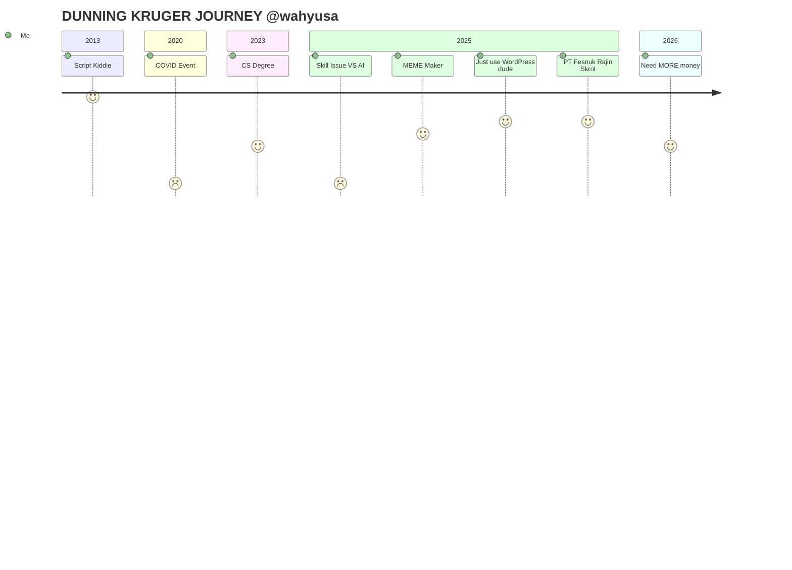

### Hi there 👋

---

## Wahyu SA

I want to work in tech 🤗

### Current Status

- Full information on my [LinkedIn](https://www.linkedin.com/in/wahyusa/)
- I have a Computer Science degree
- I am looking to transition into an intern or full-time engineering role.

**What I Actually Do**

- I build CLI tools and CRUD applications. 
- I avoid "cloud-native" complexity and microservices. 
- Writing technical notes and documentation.
- Refining web UI/UX and optimizing PageSpeed scores

**Tech Stack (I use these, but I don't claim mastery)**

- **Backend:** Go (Golang), PHP, Typesript.
- **Frontend:** Svelte, SvelteKit, Astro, Typescript, Tailwind CSS.
- **Other:** WordPress, cPanel, Laravel, Cloudflare.

**Current Projects**

- **Throwable Company Profile:** Developing affordable static sites using Astro. 
- **Technical Journal:** https://wsa.my.id
<!--
- **Boring App Usage Tracker:** Android app usage analytics (Kotlin).
- **Bleeding edge tech news:** https://200.web.id
- **Boring Storytelling Svelte**: https://junior.web.id
-->

### Joke

> Famously known as "TOP 1 NGANGGUR" (TOP 1 UNEMPLOYED GUY) in Facebook IMPHNEN

> I do have a job, it just not in tech... that's why I named my self as "NGANGGUR" 🗿

---

<section>
    <!-- From my private repo
    https://github.com/wahyusa/github-stat
    https://github.com/wahyusa/github-stat-summary
    https://github.com/wahyusa/github-readme-streak-stats -->
    

    <!-- card_height=165 is the smallest value set in my repo https://github.com/wahyusa/github-readme-streak-stats/blob/5b873f0587e19afc97d808b846f53f3ba9e6c673/api/card.php#L335 -->

<!--  -->
</section>
<!--
**wahyusa/wahyusa** is a ✨ _special_ ✨ repository because its `README.md` (this file) appears on your GitHub profile.

Here are some ideas to get you started:

- 🔭 I’m currently working on ...
- 🌱 I’m currently learning ...
- 👯 I’m looking to collaborate on ...
- 🤔 I’m looking for help with ...
- 💬 Ask me about ...
- 📫 How to reach me: ...
- 😄 Pronouns: ...
- ⚡ Fun fact: ...
-->
