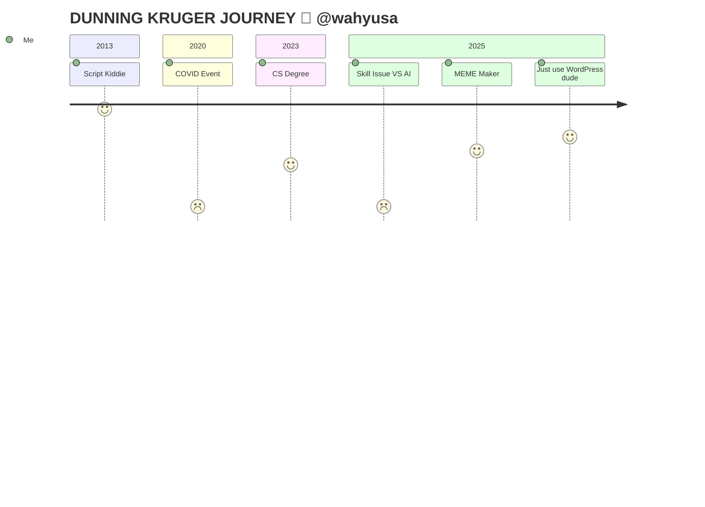

### Hi there 👋

### Sup 👋 

Welcome to my GitHub! A digital landfill where projects go to die and my youth fades. Let’s get one thing straight: I’m not “experienced”—I’m just old 😜. Like, *really* old. Old enough to remember when LLM is nothing. 

# Summary
This polite and humble guy knows enough about WordPress and general HTML, CSS, JS, PHP, GIT, cPanel, Linux, Tailwind CSS.
Love to follow tasks, guidance and rules. Tried to be as proactive partner as possible. Good enough in English. Love solving some random problem and edge cases. 👌
But ONE PROBLEM!! I don't have experiences LOL!! The best thing I can do just doing CRUD by copy-paste.

### 🤷 Wondering :
I waste many years to learn some random codes to fix my random needs and I got random knowledge and that was fun until I am getting old and need to get money.

<section>

</section>
<!--
**wahyusa/wahyusa** is a ✨ _special_ ✨ repository because its `README.md` (this file) appears on your GitHub profile.

Here are some ideas to get you started:

- 🔭 I’m currently working on ...
- 🌱 I’m currently learning ...
- 👯 I’m looking to collaborate on ...
- 🤔 I’m looking for help with ...
- 💬 Ask me about ...
- 📫 How to reach me: ...
- 😄 Pronouns: ...
- ⚡ Fun fact: ...
-->
