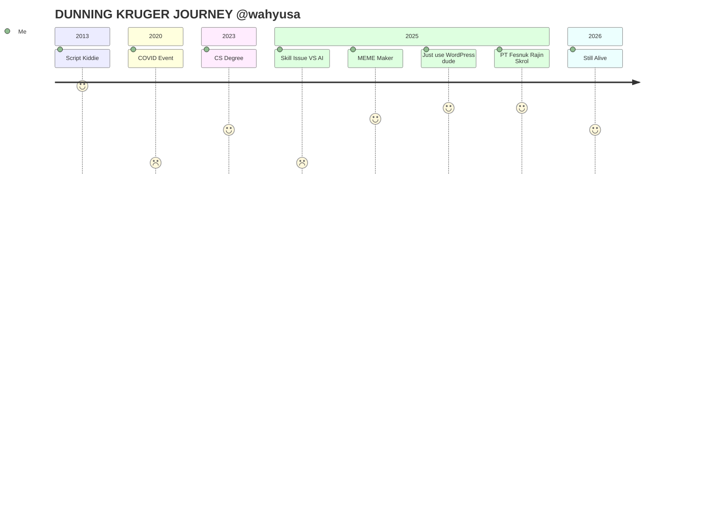

### Hi there 👋

---

Dulu gw pernah magang webdev cuma modal tutorial YouTube + copy paste Stack Overflow.

Zaman itu company masih santai lah. Masih berani nerima orang random terus dibina dari onboarding sampe bisa deploy beneran. Interview juga gak ribet-ribet amat. Asal ngerti CRUD PHP native, Bootstrap, jQuery, MySQL, udah dianggap “wah anak ini niat”.

Normalisasi database? N-blabla itu juga gak perlu, yang penting bisa CRUD data numpuk dan meledak bisa belakangan aja

Nama laptop gw waktu itu bahkan gw rename jadi:
“Fullstack”.

Gw all in banget.
Begadang tiap malam bikin portfolio random.
Belajar Laravel 8.
Nyoba React walaupun state aja masih bingung.
Install Docker di laptop kentang, gak jalan njirr.
Sewa VPS, deploy project dll

Selama magang, gw grinding brutal.

Dateng paling pagi.
Pulang paling akhir.
Tiap revisi jawab:
“Siap 👌”

Kalo nggak ya gw coba proaktif lah ya, bukannya mau caper atau gimana gw pengen dapet banyak experience tapi juga tetep perlu arahan kan... makanya kadang gw banyak nanya juga

Tiap bug fix berasa boss fight.

Pas anak lain rebahan weekend, gw malah belajar CI/CD, clean architecture, sama cloud native microservices karena takut gak diperpanjang.

Nah terus beberapa bulan kemudian...
gw diingpit jadi kartap kan

Abis itu hidup berubah.

Udah gak sempet ngoding project aneh-aneh lagi.
Sibuk daily meeting.
Deploy malem.
Fixing production.
Monitoring.
Kadang kena random error di production juga, karena waktu itu gak ada QA QA an testing ya di production 

Dan karena semuanya pindah ke GitLab company, GitHub lama gw jadi terbengkalai kan

Terus beberapa bulan lalu pas libur panjang gw iseng buka lagi GitHub lama gw...

Kaget dong.

Repository gw update semua.
Contribution graph ijo terus.
Bahkan shared hosting zaman belajar h3ngk3r di NazukaNET dibayarin terus

Ada commit baru:

“refactor hasil.txt”
“improve mailer hasil”
“fix UI make it more similar”

PANIK gw.

Gw kira akun gw kena ambil salah satu tim gw waktu magang dulu.

Pas gw cek lebih dalem...

Email commitnya ternyata bukan punya orang lain.

Itu punya istri gw.

Username GitHub gw bahkan udah diganti jadi:

“legato_sonata"

Oalah...

ternyata my bini gw yang lanjutin akun GitHub old gw.

Namanya Arturia Giallo.

Virtuosa 🤗

```mermaid
journey
    title DUNNING KRUGER JOURNEY @wahyusa
    section 2013
      Script Kiddie: 8: Me
    section 2020
      COVID Event: 1: Me
    section 2023
      CS Degree: 4: Me
    section 2025
      Skill Issue VS AI : 1: Me
      MEME Maker : 5 : Me
      Just use WordPress dude : 6 : Me
      PT Fesnuk Rajin Skrol: 6 : Me
    section 2026
      Still Alive : 4 : Me
```

<section>
    <!-- From my private repo
    https://github.com/wahyusa/github-stat
    https://github.com/wahyusa/github-stat-summary
    https://github.com/wahyusa/github-readme-streak-stats -->
    

    <!-- card_height=165 is the smallest value set in my repo https://github.com/wahyusa/github-readme-streak-stats/blob/5b873f0587e19afc97d808b846f53f3ba9e6c673/api/card.php#L335 -->

<!--  -->
</section>
<!--
**wahyusa/wahyusa** is a ✨ _special_ ✨ repository because its `README.md` (this file) appears on your GitHub profile.

Here are some ideas to get you started:

- 🔭 I’m currently working on ...
- 🌱 I’m currently learning ...
- 👯 I’m looking to collaborate on ...
- 🤔 I’m looking for help with ...
- 💬 Ask me about ...
- 📫 How to reach me: ...
- 😄 Pronouns: ...
- ⚡ Fun fact: ...
-->
